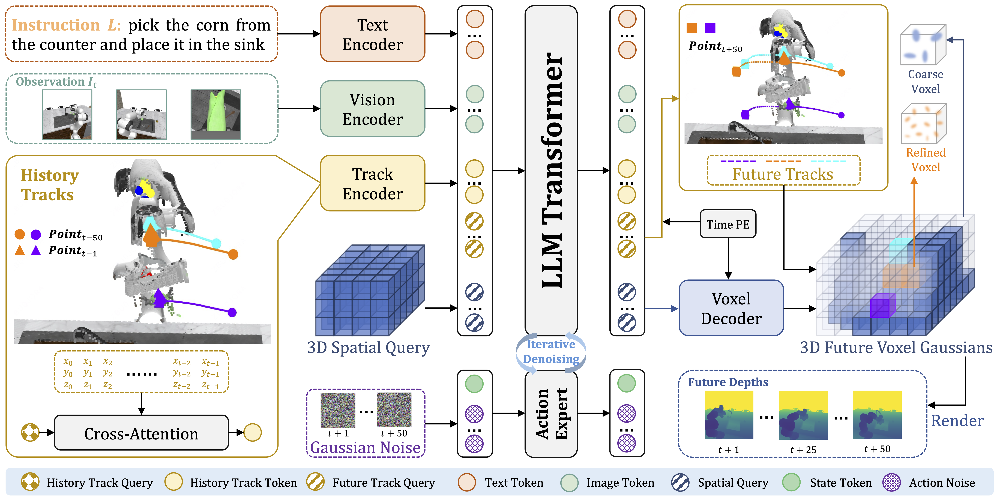
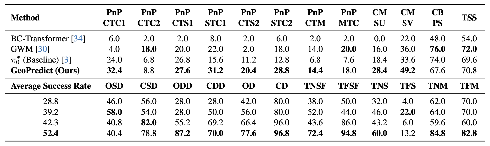
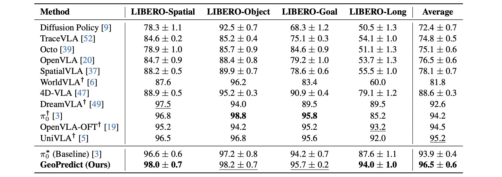

<br>
<p align="center">
  <h1 align="center"><strong>GeoPredict: Leveraging Predictive Kinematics</br> and 3D Gaussian Geometry</br> for Precise VLA Manipulation</strong></h1>
  <h3 align="center">🔥 CVPR 2026  🔥</h3>
  <p align="center">
    <a href="https://scholar.google.com/citations?user=sGDjHRUAAAAJ&hl=en" target="_blank">Jingjing Qian</a><sup>1</sup>&emsp;
    <a href="https://github.com/h161020716" target="_blank">Boyao Han</a><sup>2</sup>&emsp;
    <a href="https://scholar.google.com.hk/citations?user=o-K_AoYAAAAJ&hl=en" target="_blank">Chen Shi</a><sup>1</sup>&emsp;
    <a href="https://github.com/NickShawn" target="_blank">Lei Xiao</a><sup>1</sup>&emsp;
    Long Yang<sup>1</sup>&emsp;
    <a href="https://shishaoshuai.com" target="_blank">Shaoshuai Shi</a><sup>3</sup>&emsp;
    <a href="https://llijiang.github.io" target="_blank">Li Jiang</a><sup>1</sup>
    <br>
    <sup>1</sup>Chinese University of Hong Kong, Shenzhen&nbsp;&nbsp;
    <sup>2</sup>Hunan University&nbsp;&nbsp;
    <sup>3</sup>Voyager Research, Didi Chuxing
  </p>
</p>

<div id="top" align="center">

[](https://arxiv.org/abs/2512.16811)
[](https://arxiv.org/pdf/2512.16811)
[](https://jingjingqian75.github.io/GeoPredict-Page/)

</div>

---

## 🔥 News
- **[2026-02]** Our paper was accepted by CVPR2026 as a **Highlight** ! 🥳
- **[2025-12]** We released the [paper](https://arxiv.org/pdf/2512.16811) and the [project page](https://jingjingqian75.github.io/GeoPredict-Page/) for **GeoPredict**.

---

## 🎄 Overview
**GeoPredict** is a geometry-aware vision-language-action (VLA) framework for robotic manipulation.
Existing methods are often limited by:
1) **2D-Centric Formulation**: operate in 2D image space, lacking explicit 3D spatial modeling.
2) **Reactive Control**: map observations reactively, failing to anticipate future physical dynamics.
3) **Geometric Inconsistency**: view-independent predictions struggle to enforce 3D consistency.

GeoPredict addresses these limitations with:
1) **Geometry-Aware VLA**: augments VLA with predictive kinematic and 3D geometric priors.
2) **Predictive 3D Modeling**: forecasts workspace geometry using track-guided 3DGS refinement.
3) **Lightweight Inference**: uses predictive modules solely for training, reducing test-time overhead.

---

## 📝 TODO
- [x] Release paper and project page.
- [ ] Release evaluation code. Expected in April 2026.
- [ ] Release training code. Expected in May 2026.
- [ ] Support more open-source VLA models, such as Pi0.5 and OpenVLA. Expected in June 2026.

---

## 📖 Framework
<div align="center">
  
</div>

GeoPredict consists of three key components:

- **(a) Trajectory-Level Kinematic Prediction**: encodes motion history of robot keypoints into compact tokens via a Track Encoder, and predicts multi-step 3D keypoint trajectories using learnable future track queries.
- **(b) Predictive 3D Gaussian Geometry**: decodes a coarse 3D spatial query into initial Gaussian primitives to represent workspace geometry, and forecasts how the explicit 3D scene representation evolves across multiple future timesteps.
- **(c) Track-Guided Refinement & Rendering**: adaptively increases Gaussian density along predicted trajectories to capture task-relevant interaction regions, and supervises the predictive 3DGS exclusively through future depth-map rendering without color modeling.

---

## 📊 Results
<div align="center">
  <h4>RoboCasa Simulation Benchmark Results</h4>
  
</div>

<div align="center">
  <h4>LIBERO Simulation Benchmark Results</h4>
  
</div>

We report strong performance on both **RoboCasa Human-50** and **LIBERO** benchmarks, demonstrating the effectiveness of GeoPredict in geometry-intensive and spatially demanding manipulation tasks. Please see the paper for full tables, metrics, and more detailed analysis.

---

## 📬 Contact
If you have questions about the paper, feel free to open an issue or contact:
- **Jingjing Qian**: `jingjingqian.0705@gmail.com`

---

## 🔗 Citation
If you find our work helpful, please cite:

```bibtex
@misc{qian2025geopredict,
  title={GeoPredict: Leveraging Predictive Kinematics and 3D Gaussian Geometry for Precise VLA Manipulation},
  author={Jingjing Qian and Boyao Han and Chen Shi and Lei Xiao and Long Yang and Shaoshuai Shi and Li Jiang},
  year={2025},
  eprint={2512.16811},
  archivePrefix={arXiv},
  primaryClass={cs.CV},
  url={https://arxiv.org/abs/2512.16811},
}
```
